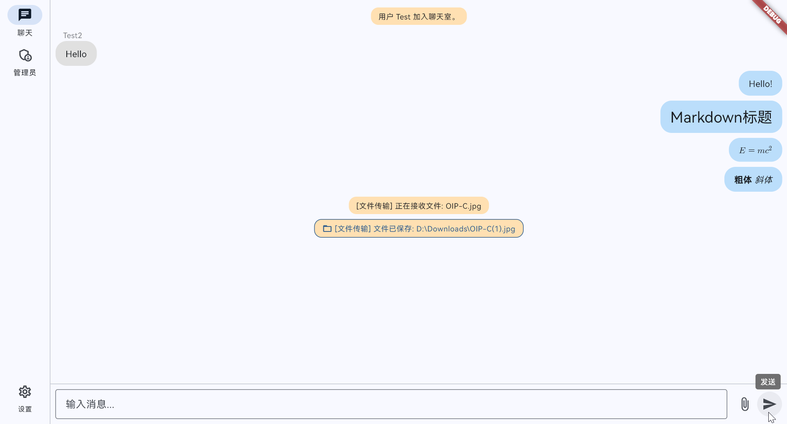
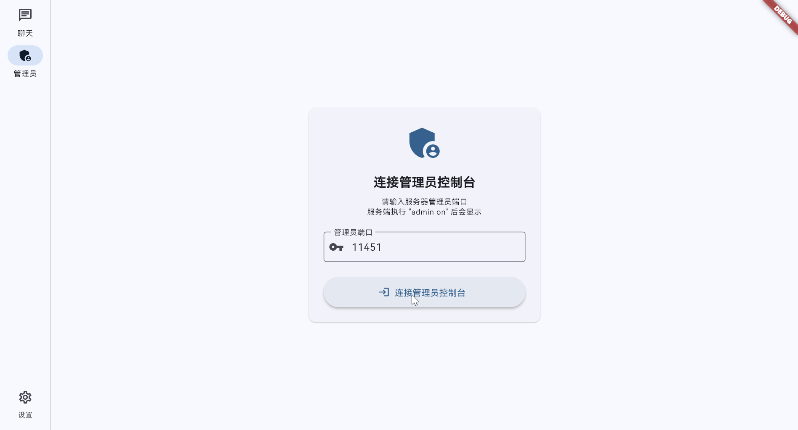
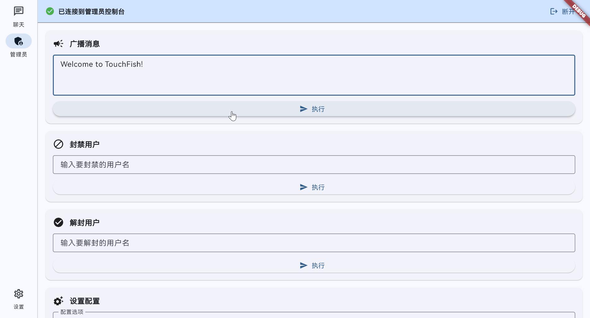
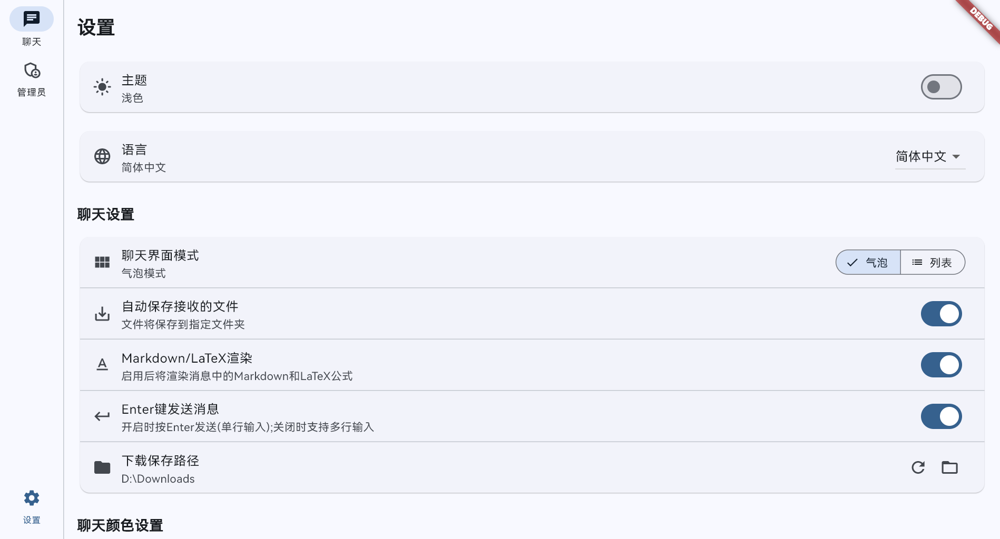
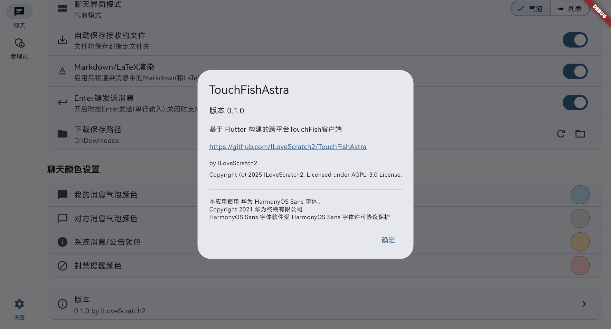
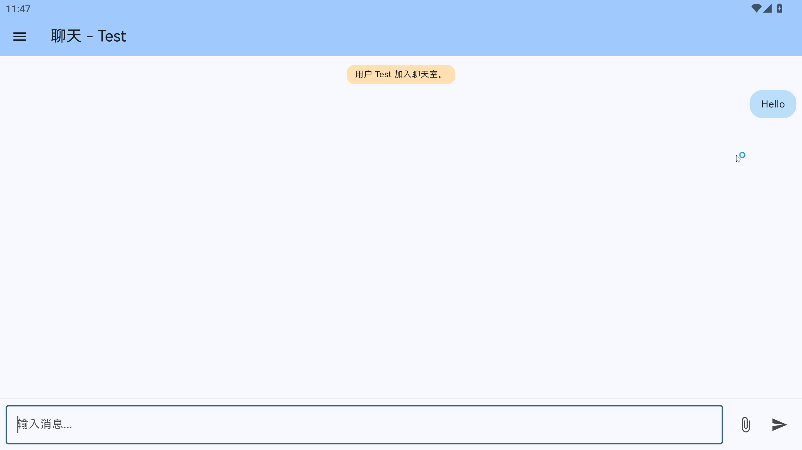
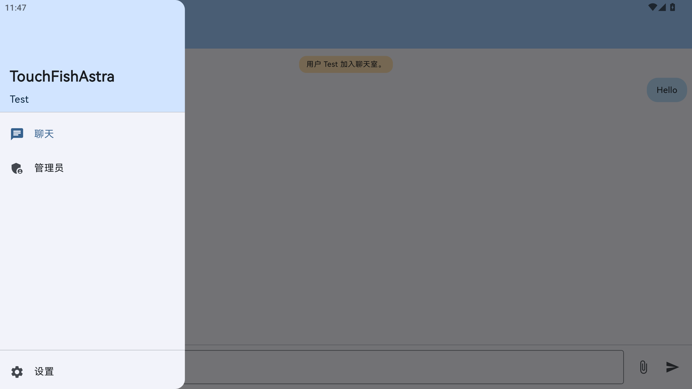
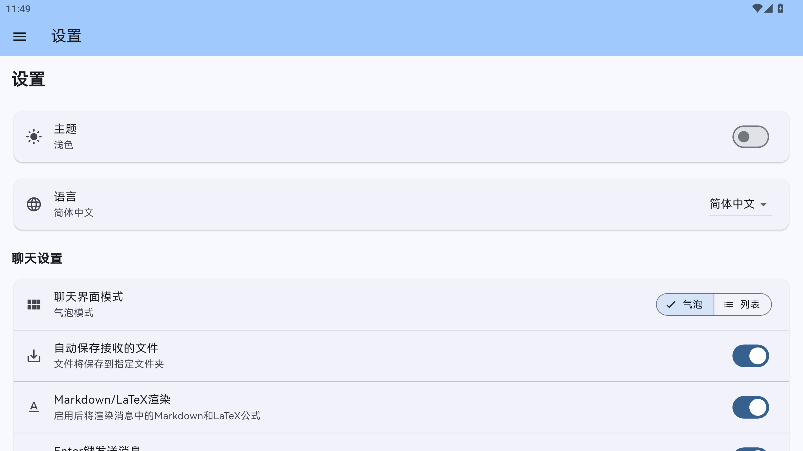
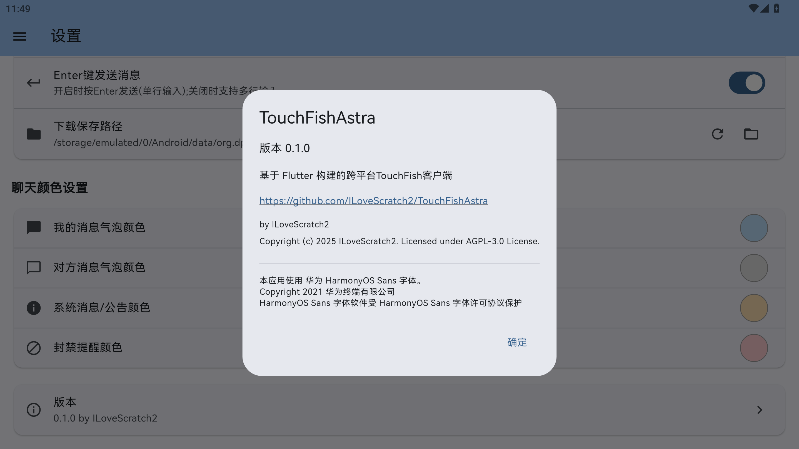

# TouchFish Astra

 

一个跨平台的TouchFish客户端，支持TouchFish V4

> [!IMPORTANT]  
> 更新：
>
> TouchFish v4已发布，目前无 WebSocket 协议，整合 Client 和 Server 端为一个程序。
>
> TouchFish Astra v2.0.1 及以上 已适配 TouchFish V4 协议！（目前截止2026.1.7 唯一适配TF V4的GUI发行版）
>
> 新版本将不再会支持 TouchFish V3 及以下版本的协议，如有需求请使用`v1.0.1`及更低版本。
> Android 新版更改包名为`org.dpdns.ilovescratch.tfastra.v4`，可以与旧版本共存
>
> 适配 TouchFish V4 后，支持更多功能：
> - 多行消息支持
> - ~~Web 端 支持（基于新WebSocket协议）~~ 无了
> - 更稳定的连接和更可控的文件传输
> - 优化的UI设计
> - 改进的管理员功能
> - 私聊
> - 以及更多新功能（根据 V4 开发进度，可能会有变动，不保证以上内容全部完整实现）
> 敬请期待！

## 简介

在洛谷上看到了[TouchFish的相关内容](https://github.com/2044-space-elevator/TouchFish)，~~非常适合摸鱼~~

现有客户端（目前TF V4只有这个GUI客户端了……）大多仅局限于一个平台，于是实现一个跨平台的TouchFish客户端。

基于Flutter框架，可以在Windows、Linux、macOS 和 Android上运行。

## 功能特点
 - Material Design用户界面
 - 跨平台支持 Windows MacOS GNU/Linux Android
 - 连接聊天服务器并聊天
    - 发送文本
    - 发送文件
    - 接收文件
    - Markdown/LaTeX支持
    - TouchFish V4 私聊
    - TouchFish V4 历史消息
- 高度自定义设置
- 暗色/浅色主题切换
- 多语言支持
- 消息气泡支持（独有）
- 管理员功能支持
- 消息通知
- 彩蛋（点击应用`关于`页面的应用标题`TouchFishAstra`试试？）（其实还有另一个彩蛋，但是用户触发不了，你能否找出？）
- 节日特定主题

## Screenshots（旧版TouchFish Astra，与当前版本存在较大区别，仅供参考）

  
  

  
  

  
  

  
  

  
  

## 使用

前往Releases页面下载对应平台的可执行文件，安装/运行即可。

需要连接到一个运行中的 **[TouchFish](https://github.com/2044-space-elevator/TouchFish)或其他兼容服务端** 服务器。

## 安装与运行

### Windows: 

下载Windows压缩包，全部解压到一个文件夹后运行即可（注意必须全部解压，而不是在压缩包内双击EXE）或运行安装程序（预计存在于TouchFish Astra v2.2.0+）

最低系统要求为 Windows 10

需要 Microsoft Visual C++ 库，没有可前往 <https://learn.microsoft.com/zh-cn/cpp/windows/latest-supported-vc-redist?view=msvc-170> 安装，安装后无须重启

### MacOS

下载 MacOS 压缩包，解压后运行即可。
你可能需要在设置里打开从未认证的开发者处下载的应用

您可能只有使用 TouchFish Astra v2.2.0+ 才能连接到远程服务器

### Linux

解压后运行 ELF 即可，由于Glibc版本要求，不保证在任何发行版上可用

### Android

提供AAB和APK，推荐使用APK，如果你不知道什么是AAB，请直接下载APK安装

Android包名为`org.dpdns.ilovescratch.tfastra.v4`（对于v2.0.1+）或`org.dpdns.ilovescratch.tfastra`（对于更低版本）

SDK 编译版本 36 (Android 16.0)

SDK 运行版本 36 (Android 16.0)

SDK 最小兼容版本 24 (Android 7.0)

权限说明:
 - `android.permission.INTERNET` 用于连接到远程 TouchFish 服务器
 - `android.permission.MANAGE_EXTERNAL_STORAGE` `android.permission.READ_EXTERNAL_STORAGE` `android.permission.WRITE_EXTERNAL_STORAGE` 用于下载文件
 - `android.permission.POST_NOTIFICATIONS` `android.permission.VIBRATE` 用于发送通知和提醒

## Contributing

欢迎提交PR或Issue，帮助完善这个项目。

在提交Issue前，请确保搜索过现有的Issue，避免重复提交。
在提交PR前，请阅读[贡献指南](CONTRIBUTING.md)。

## License

本项目使用[GNU Affero General Public License v3.0](LICENSE)进行许可。

此最强 Copyleft 许可的权限以在同一许可下提供许可作品和修改的完整源代码为条件，其中包括使用许可作品的较大作品。版权和许可声明必须保留 贡献者明确授予专利权。当使用修改后的版本通过网络提供服务时，必须提供修改后版本的完整源代码。

## Font License

本项目使用由华为终端有限公司提供的HarmonyOS Sans字体，字体软件受HarmonyOS Sans字体许可协议保护。

字体版权归华为终端有限公司所有。

详细信息请参阅[LICENSE-FONT](LICENSE-FONT)。
