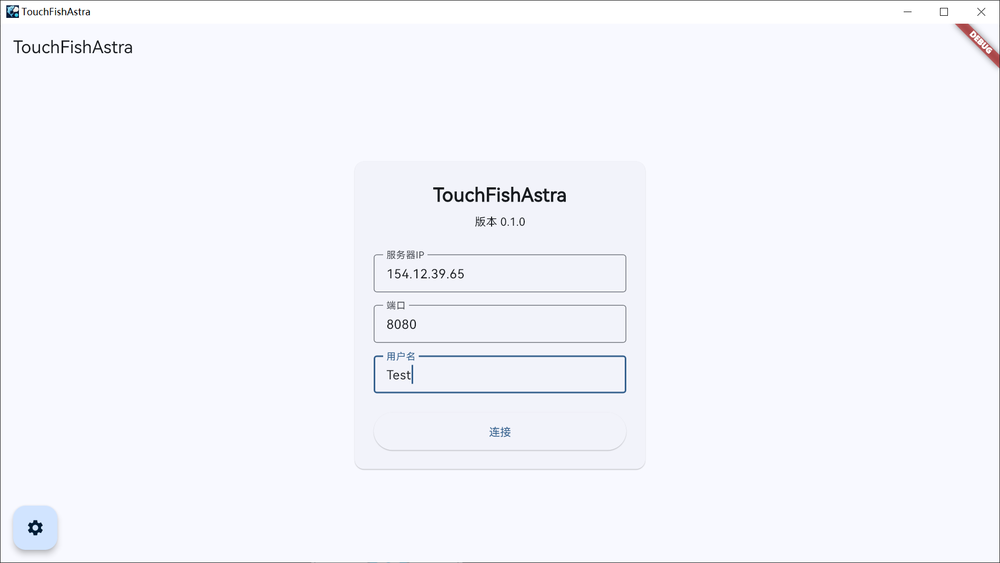

# TouchFish Astra    

  

一个跨平台的TouchFish客户端
    

## 简介

在洛谷上看到了[TouchFish的相关内容](https://github.com/2044-space-elevator/TouchFish)，~~非常适合摸鱼~~

现有客户端大多仅局限于一个平台，于是实现一个跨平台的TouchFish客户端。

基于Flutter框架，可以在Windows、Linux、macOS 和 Android上运行。

## 功能特点
 - 简洁风格Material Design用户界面
 - 跨平台支持
 - 连接聊天服务器并聊天
    - 发送文本
    - 发送文件
    - 接收文件
    - Markdown/LaTeX支持
- 高度自定义设置
- 暗色/浅色主题切换
- 多语言支持
- 消息气泡支持
- 管理员功能支持

## Screenshots

  
  

  
  

  
  

  
  

  
  

## 使用

前往Releases页面下载对应平台的可执行文件，安装/运行即可。

需要连接到一个运行中的 [TouchFish](https://github.com/2044-space-elevator/TouchFish)或其他兼容服务端 服务器。

Windows: 下载Windows压缩包，全部解压到一个文件夹后后运行即可（注意必须全部解压，而不是在压缩包内双击EXE）

MacOS: 下载MacOS压缩包，解压后运行即可。
你可能需要在设置里打开从未认证的开发者处下载的应用

Linux: 解压后运行即可

Android: 提供AAB和APK，如果你不知道什么是AAB请直接下载APK安装

## Contributing

欢迎提交PR或Issue，帮助完善这个项目。

在提交Issue前，请确保搜索过现有的Issue，避免重复提交。
在提交PR前，请阅读[贡献指南](CONTRIBUTING.md)。

## License

本项目使用[GNU Affero General Public License v3.0](LICENSE)进行许可。

## Font License

本项目使用由华为终端有限公司提供的HarmonyOS Sans字体，字体软件受HarmonyOS Sans字体许可协议保护。

字体版权归华为终端有限公司所有。

详细信息请参阅[LICENSE-FONT](LICENSE-FONT)。
